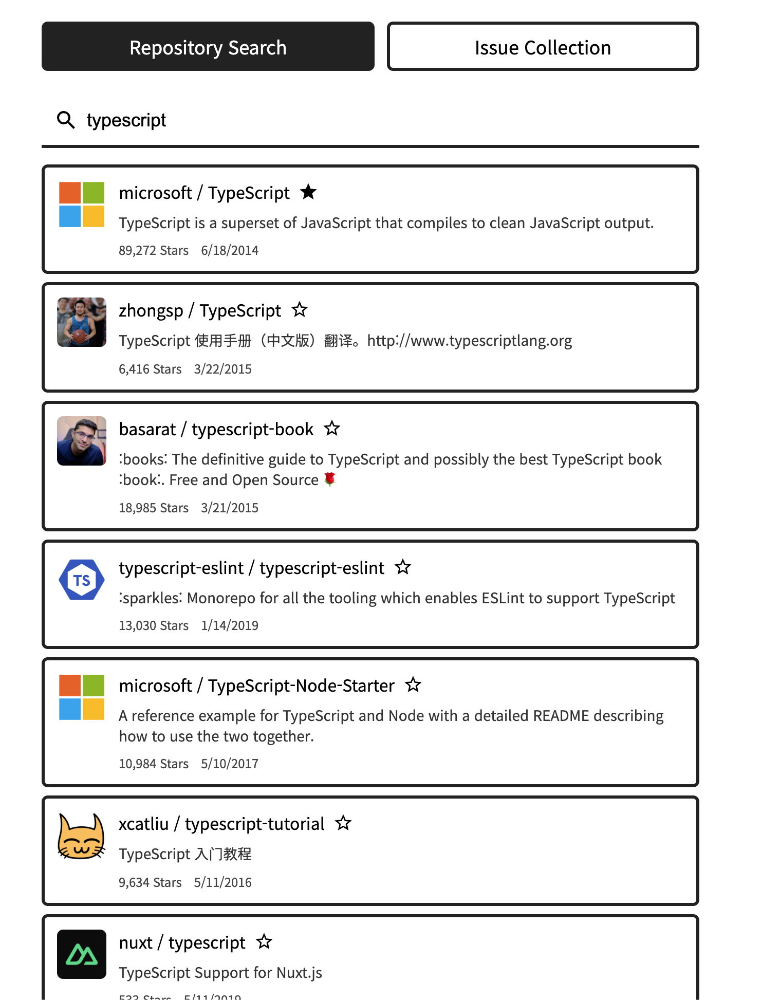
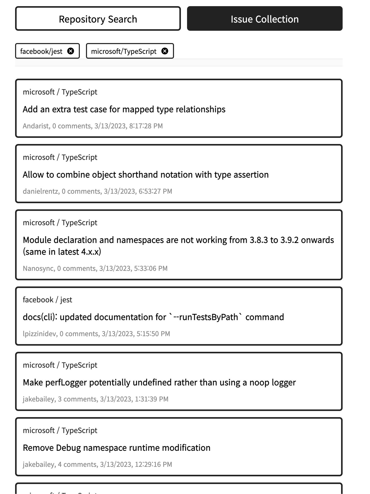

# Payhere Assignment

## 환경

- nodejs 18.14.2, yarn 1.22.29
- Chrome Version 111.0.5563.64 (Official Build) (arm64)
- M1 Macbook Pro, OSX 13.2.1

## 설치

```
yarn
```

## 실행

### 개발

```
yarn dev
```

### 프로덕션

```
yarn build
yarn start
```

이후 `http://localhost:3000` 접속

빌드 혹은 개발하기 전에 `.env.local` 파일을 작성하여 토큰 주입 가능

```
GITHUB_TOKEN="YOUR_GITHUB_TOKEN"
```

## 실행 화면




